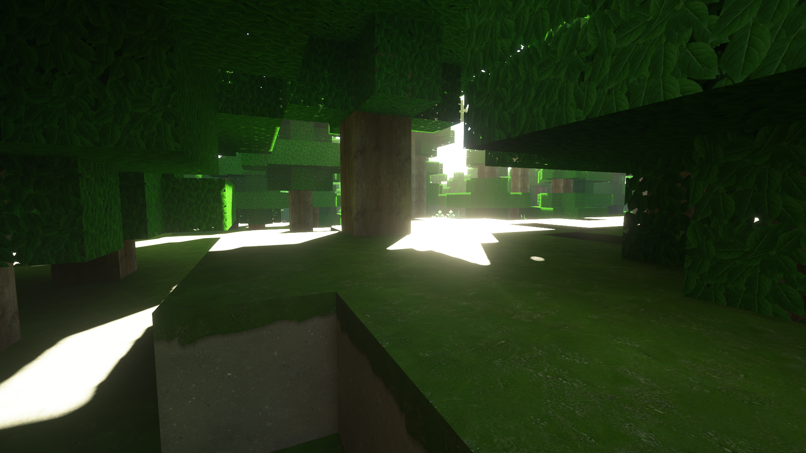
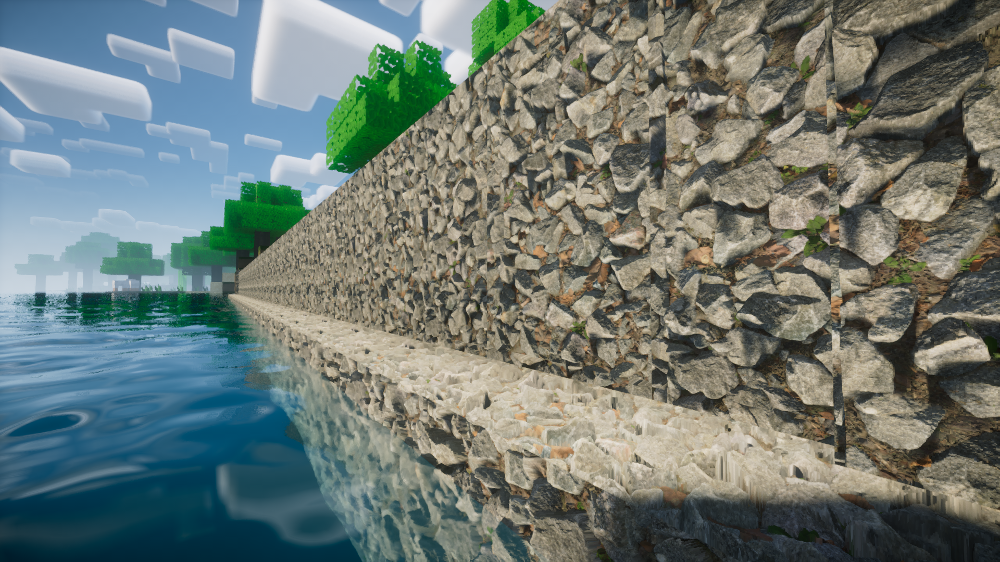
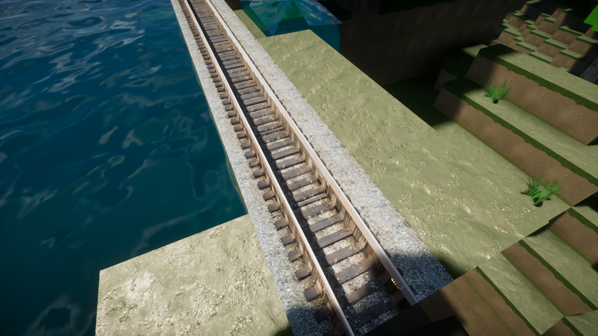
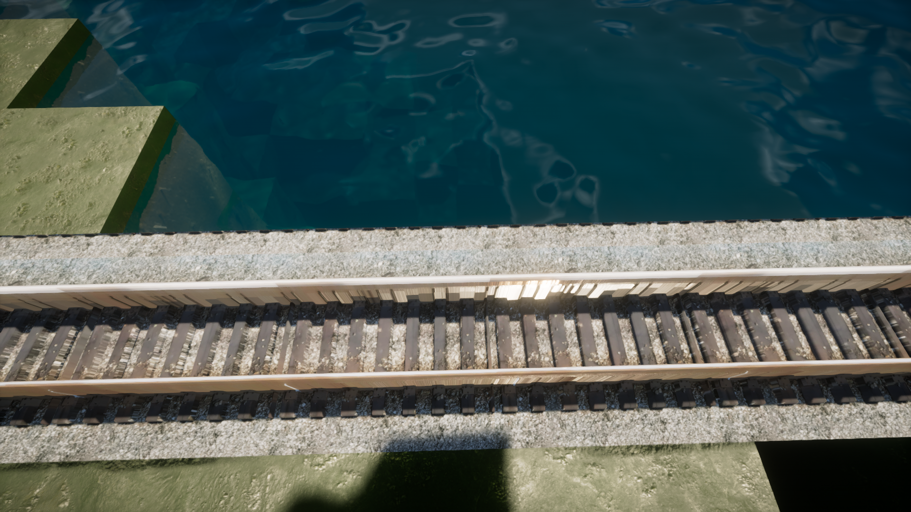

# Demon's Nation of Realism

**Demon's Nation of Realism** is a high-resolution, photorealistic resource pack for **Minecraft Java Edition**, designed to deliver hyper-realistic visuals with 1024x textures. Built for players who want to experience Minecraft with a cinematic level of realism, this pack supports advanced graphics technologies like **POM (Parallax Occlusion Mapping)** and **PBR (Physically Based Rendering)**.

 <!-- Replace with actual preview image path if available -->

## 🌟 Features

- **1024x Resolution** for ultra-detailed textures
- **Photorealistic style** with lifelike surfaces and materials
- **POM/PBR support** for enhanced realism (requires shaders)
- **Modular Extensions** for POM and PBR (activate one at a time)
- **MIT Licensed** – Free and open-source
- **PE Beta Version Available** (without POM/PBR)

---

## 🔧 Installation

### For Java Edition

1. Download the latest version of the resource pack from:
   - [CurseForge](https://www.curseforge.com/minecraft/texture-packs/demons-nation-of-realism-1024x-pom-pbr-for-free)
   - [Planet Minecraft](https://www.planetminecraft.com/texture-pack/demon-s-nation-of-realism-1024x-photorealistic-minecraft-javaedition-rp-pbr-pom-supported/)

2. Move the `.zip` file into your Minecraft `resourcepacks` folder:

\~/.minecraft/resourcepacks/

3. Launch Minecraft and go to **Options > Resource Packs**, then activate **Demon's Nation of Realism**.

4. (Optional) For POM/PBR support:
- Use a shader like **SEUS PTGI**, **BSL**, or **Continuum**. (Recommended: **Nostalgia Shader With POM**)
- Make sure to activate the relevant **POM** or **PBR** extension pack (use only one at a time).

*Note :- The Resource Pack's Pre Maded Zip System is eliminated, Not DNR (Demon's Nation Of Realism) Uses a live pack building system for each user to give latest version directly from repo via [directory-downloader](https://download-directory.github.io/)*

---

### For Pocket Edition (PE)

A beta version is available (POM/PBR not supported):
- [Download PE version](https://mcpedl.com/demon-s-nation-of-realism-pe-beta/)

---

## 📂 Folder Structure

Demon's Nation of Realism/
├── \REPO FILES
├── \Base_Pack
├── \[Optional] POM\_Extension
└── \[Optional] PBR\_Extension

Only load one of the optional extensions at a time to prevent graphical glitches.

---

## 📜 License

This project is licensed under the [MIT License](LICENSE). You are free to use, modify, and distribute it with attribution.

---

## 💬 Credits

Created by **Darkyboys** and contributors.  
Special thanks to the Minecraft community for shader and PBR/POM support.

---

## 📸 Screenshots

---

## 🧠 Tips

- For best results, allocate more RAM to Minecraft (8GB recommended).
- Always use **OptiFine** or **Iris + Sodium** for advanced shader support.

---

## 💌 Support or Feedback?

Open an issue on [GitHub](https://github.com/darkyboys/demon-nation-of-realism) or reach out via the comments on CurseForge or Planet Minecraft.
